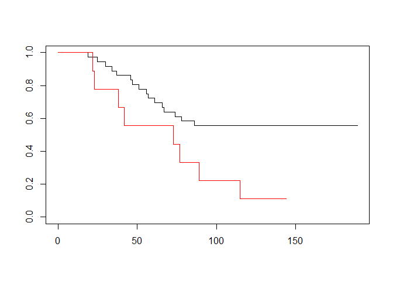
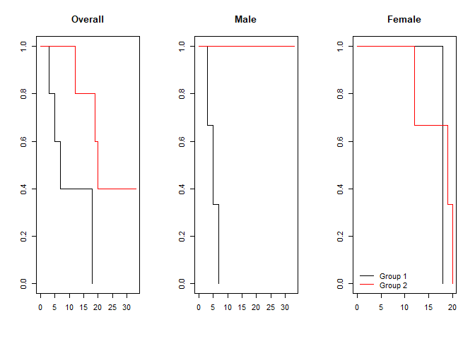
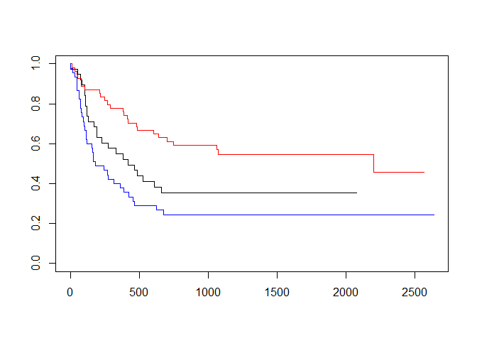
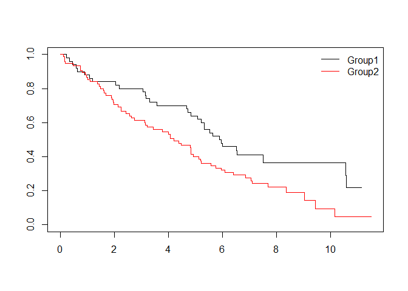
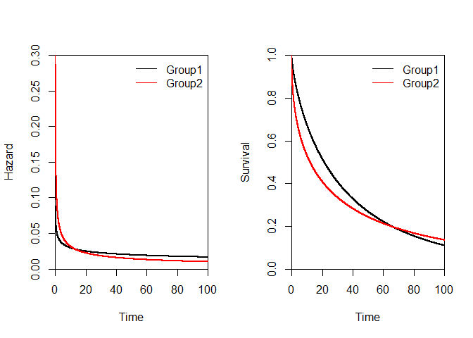
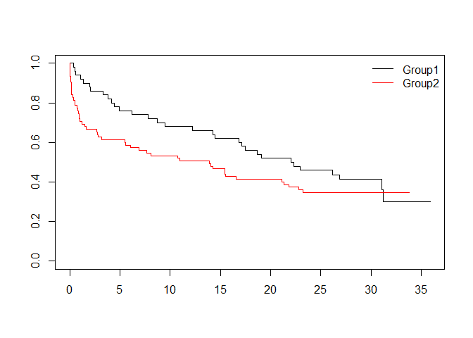

Breast Cancer: Log-Rank, Hazard, and more
================
David Alexander Moe

``` r
library(survival)
library(KMsurv) # get the dataset "btrial" from it
```

    ## Warning: il pacchetto 'KMsurv' è stato creato con R versione 4.3.0

``` r
################################
# Log-rank test in Breast Cancer 
#################################
data(btrial)
help(btrial) #talk a bit about landmark analysis
```

    ## avvio in corso del server httpd per la guida ... fatto

``` r
btrial
```

    ##    time death im
    ## 1    19     1  1
    ## 2    25     1  1
    ## 3    30     1  1
    ## 4    34     1  1
    ## 5    37     1  1
    ## 6    46     1  1
    ## 7    47     1  1
    ## 8    51     1  1
    ## 9    56     1  1
    ## 10   57     1  1
    ## 11   61     1  1
    ## 12   66     1  1
    ## 13   67     1  1
    ## 14   74     1  1
    ## 15   78     1  1
    ## 16   86     1  1
    ## 17  122     0  1
    ## 18  123     0  1
    ## 19  130     0  1
    ## 20  130     0  1
    ## 21  133     0  1
    ## 22  134     0  1
    ## 23  136     0  1
    ## 24  141     0  1
    ## 25  143     0  1
    ## 26  148     0  1
    ## 27  151     0  1
    ## 28  152     0  1
    ## 29  153     0  1
    ## 30  154     0  1
    ## 31  156     0  1
    ## 32  162     0  1
    ## 33  164     0  1
    ## 34  165     0  1
    ## 35  182     0  1
    ## 36  189     0  1
    ## 37   22     1  2
    ## 38   23     1  2
    ## 39   38     1  2
    ## 40   42     1  2
    ## 41   73     1  2
    ## 42   77     1  2
    ## 43   89     1  2
    ## 44  115     1  2
    ## 45  144     0  2

``` r
table(btrial$im)
```

    ## 
    ##  1  2 
    ## 36  9

``` r
est_3=survfit(Surv(btrial$time,btrial$death)~btrial$im)
plot(est_3,col=c("black","red"))
```

<!-- -->

``` r
survdiff(Surv(btrial$time,btrial$death)~btrial$im,rho=0)
```

    ## Call:
    ## survdiff(formula = Surv(btrial$time, btrial$death) ~ btrial$im, 
    ##     rho = 0)
    ## 
    ##              N Observed Expected (O-E)^2/E (O-E)^2/V
    ## btrial$im=1 36       16    20.19     0.869      5.49
    ## btrial$im=2  9        8     3.81     4.599      5.49
    ## 
    ##  Chisq= 5.5  on 1 degrees of freedom, p= 0.02

``` r
help("survdiff")

#########################################
# Wilcoxon Test
#########################################
data(btrial)

# wilcoxon_test(btrial$time,btrial$death,btrial$im)
wilcoxon_test=function(X,delta,Z){
  # X=btrial$time;delta=btrial$death;Z=btrial$im
  # Z is the group indicator
  n=length(X)
  Z_cat=unique(Z)
  n1=sum(Z==Z_cat[1])
  n2=sum(Z==Z_cat[2])
  t_j=sort(unique(X[delta==1]))
  n_D=length(t_j)
  
  help(array) #"...If there are too few elements in data to fill the array, then the elements 
  #  in data are recycled."
  temp=array(X,c(n,n_D))
  temp2=t(array(t_j,c(n_D,n)))
  temp3=array(delta,c(n,n_D))
  temp4=array(temp==temp2 & temp3==1,c(n,n_D)) #rows: subjects; columns: uniques times t_j
  #TRUE if a given subject had an event at a given time  
  D_j=apply(temp4,2,sum)
  
  temp=array(X[Z==Z_cat[1]],c(n1,n_D))
  temp2=t(array(t_j,c(n_D,n1)))
  temp3=array(delta[Z==Z_cat[1]],c(n1,n_D))
  temp4=array(temp==temp2 & temp3==1,c(n1,n_D))
  D_1j=apply(temp4,2,sum)
  
  temp=array(X[Z==Z_cat[2]],c(n2,n_D))
  temp2=t(array(t_j,c(n_D,n2)))
  temp3=array(delta[Z==Z_cat[2]],c(n2,n_D))
  temp4=array(temp==temp2 & temp3==1,c(n2,n_D))
  D_2j=apply(temp4,2,sum)
  
  temp=array(X,c(n,n_D))
  temp2=t(array(t_j,c(n_D,n)))
  temp3=array(temp>=temp2,c(n,n_D))
  Y_j=apply(temp3,2,sum)
  
  temp=array(X[Z==Z_cat[1]],c(n1,n_D))
  temp2=t(array(t_j,c(n_D,n1)))
  temp3=array(temp>=temp2,c(n1,n_D))
  Y_1j=apply(temp3,2,sum)
  
  temp=array(X[Z==Z_cat[2]],c(n2,n_D))
  temp2=t(array(t_j,c(n_D,n2)))
  temp3=array(temp>=temp2,c(n2,n_D))
  Y_2j=apply(temp3,2,sum)
  
  U=sum(Y_j*(D_1j-D_j*Y_1j/Y_j))
  V=sum(Y_j*Y_j*D_j*(Y_1j/Y_j)*(Y_2j/Y_j)*((Y_j-D_j)/(Y_j-1)))
  
  print(paste("Chisq= ",round((U^2)/V,1),sep=""))
  print(paste("p= ",round(1-pchisq((U^2)/V,df=1),4),sep=""))
}

wilcoxon_test(btrial$time,btrial$death,btrial$im)
```

    ## [1] "Chisq= 4.4"
    ## [1] "p= 0.037"

``` r
# in this case an approximation is...
# survdiff(Surv(btrial$time,btrial$death)~btrial$im,rho=1)

###########################
#Class example
###########################

X1=c(15,18,19,19,20)
delta1=c(1,1,1,1,1)

X2=c(16,18,20,23,24)
delta2=c(0,0,0,1,0)

X=c(X1,X2)
delta=c(delta1,delta2)
group=c(rep(1,length(X1)),rep(2,length(X2)))
output=survfit(Surv(X,delta)~1)
cbind(output$time,output$n.event,output$n.risk)
```

    ##      [,1] [,2] [,3]
    ## [1,]   15    1   10
    ## [2,]   16    0    9
    ## [3,]   18    1    8
    ## [4,]   19    2    6
    ## [5,]   20    1    4
    ## [6,]   23    1    2
    ## [7,]   24    0    1

``` r
logranktest=survdiff(Surv(X,delta)~group,rho=0)
print(logranktest)
```

    ## Call:
    ## survdiff(formula = Surv(X, delta) ~ group, rho = 0)
    ## 
    ##         N Observed Expected (O-E)^2/E (O-E)^2/V
    ## group=1 5        5     2.25      3.36      6.95
    ## group=2 5        1     3.75      2.02      6.95
    ## 
    ##  Chisq= 7  on 1 degrees of freedom, p= 0.008

``` r
logranktest$chisq
```

    ## [1] 6.954023

``` r
# Weighted tests
# With rho = 0 this is the log-rank test, and with rho = 1 it is equivalent to the Peto & Peto 
# modification of the Gehan-Wilcoxon test.
# See NotesOnTest.pdf
help("survdiff")
petopeto=survdiff(Surv(X,delta)~group,rho=1)
petopeto
```

    ## Call:
    ## survdiff(formula = Surv(X, delta) ~ group, rho = 1)
    ## 
    ##         N Observed Expected (O-E)^2/E (O-E)^2/V
    ## group=1 5    4.000     1.87      2.43      6.04
    ## group=2 5    0.394     2.52      1.80      6.04
    ## 
    ##  Chisq= 6  on 1 degrees of freedom, p= 0.01

``` r
FH_82=survdiff(Surv(X,delta)~group,rho=2)
FH_82
```

    ## Call:
    ## survdiff(formula = Surv(X, delta) ~ group, rho = 2)
    ## 
    ##         N Observed Expected (O-E)^2/E (O-E)^2/V
    ## group=1 5    3.326     1.59      1.88      5.15
    ## group=2 5    0.155     1.89      1.59      5.15
    ## 
    ##  Chisq= 5.2  on 1 degrees of freedom, p= 0.02

``` r
#require(survMisc)
#fit = survfit(Surv(X,delta)~group)
#comp(ten(fit))$tests$lrTests

#########################################
#Stratified Logrank Test
#########################################

grouph=c(1,1,1,1,1,2,2,2,2,2) # groups: 1 = old 2 = new
hypdata=c(3,5,7,9,18,12,19,20,20,33) # the data
cen=c(1,1,1,0,1,1,1,1,0,0) # censor status: 1 = uncensored; 0 = censored
sex=c(1,1,1,2,2,2,2,2,1,1) # sex = 1 for male, sex = 2 for female

par(mfcol=c(1,3))
plot(survfit(Surv(hypdata,cen)~grouph),col=c("black","red"))
title(main = "Overall")
survdiff(Surv(hypdata,cen)~grouph)
```

    ## Call:
    ## survdiff(formula = Surv(hypdata, cen) ~ grouph)
    ## 
    ##          N Observed Expected (O-E)^2/E (O-E)^2/V
    ## grouph=1 5        4     1.69      3.18       5.2
    ## grouph=2 5        3     5.31      1.01       5.2
    ## 
    ##  Chisq= 5.2  on 1 degrees of freedom, p= 0.02

``` r
plot(survfit(Surv(hypdata[sex==1],cen[sex==1])~grouph[sex==1]),col=c("black","red"))
title(main = "Male")
plot(survfit(Surv(hypdata[sex==2],cen[sex==2])~grouph[sex==2]),col=c("black","red"))
title(main = "Female")
legend("bottomleft",legend=c("Group 1","Group 2"),col=c("black","red"),lty=c(1,1),bty="n")
```

<!-- -->

``` r
par(mfcol=c(1,1))

survdiff(Surv(hypdata,cen)~grouph+strata(sex))
```

    ## Call:
    ## survdiff(formula = Surv(hypdata, cen) ~ grouph + strata(sex))
    ## 
    ##          N Observed Expected (O-E)^2/E (O-E)^2/V
    ## grouph=1 5        4     2.02     1.951      3.51
    ## grouph=2 5        3     4.98     0.789      3.51
    ## 
    ##  Chisq= 3.5  on 1 degrees of freedom, p= 0.06

``` r
# possible interaction!
#########################################
#G-group Logrank Test
#########################################
data(bmt)
help(bmt)

table(bmt$group)
```

    ## 
    ##  1  2  3 
    ## 38 54 45

``` r
#Compare disease free survival in 3 groups
#Event of interest: Death or relapse
table(bmt$d2,bmt$d3)
```

    ##    
    ##      0  1
    ##   0 54 41
    ##   1  0 42

``` r
plot(survfit(Surv(bmt$t2,bmt$d3)~bmt$group),col=c("black","red","blue"))
```

<!-- -->

``` r
survdiff(Surv(bmt$t2,bmt$d3)~bmt$group)
```

    ## Call:
    ## survdiff(formula = Surv(bmt$t2, bmt$d3) ~ bmt$group)
    ## 
    ##              N Observed Expected (O-E)^2/E (O-E)^2/V
    ## bmt$group=1 38       24     21.9     0.211     0.289
    ## bmt$group=2 54       25     40.0     5.604    11.012
    ## bmt$group=3 45       34     21.2     7.756    10.529
    ## 
    ##  Chisq= 13.8  on 2 degrees of freedom, p= 0.001

``` r
######################################
### SAMPLE SIZE CALCULATION ##########
######################################

#Parameters
alpha=0.05
beta=0.1
median_surv_1=1
median_surv_2=1.5
hazard_1=-log(0.5)/median_surv_1
hazard_2=log(2)/median_surv_2
hazard_ratio=hazard_1/hazard_2
A=2
tau=4

# Total number of deaths
d=4*((qnorm(1-alpha/2) + qnorm(1-beta))^2)/(log(hazard_ratio)^2)
d
```

    ## [1] 255.652

``` r
# Proportion of events in each group
p_1=1-(exp(-hazard_1*(tau-A))-exp(-hazard_1*tau))/(hazard_1*A)
p_2=1-(exp(-hazard_2*(tau-A))-exp(-hazard_2*tau))/(hazard_2*A)

#Number patients in each group (1:1 allocation)
n=d/(p_1+p_2)
n
```

    ## [1] 159.2099

``` r
####################################
#Simulated data proportional hazards
####################################
Beta=-0.5
lambda2=0.2
lambda1=lambda2*exp(Beta)
n1=50
n2=75
time=seq(from=0,to=50,by=0.01)
S1=exp(-lambda1*time)
S2=exp(-lambda2*time)

par(mfcol=c(1,2))
#Hazard plots
plot(time,rep(lambda1,length(time)),type="l",lwd=2,xlab="Time",ylab="Hazard",xaxs="i",yaxs="i",ylim=c(0,0.3))
lines(time,rep(lambda2,length(time)),lwd=2,col="red")
legend("topright",legend=c("Group1","Group2"),col=c("black","red"),lty=c(1,1),bty="n")

#Survival plots
plot(time,S1,type="l",lwd=2,xlab="Time",ylab="Survival",xaxs="i",yaxs="i",ylim=c(0,1))
lines(time,S2,lwd=2,col="red")
legend("topright",legend=c("Group1","Group2"),col=c("black","red"),lty=c(1,1),bty="n")
```

<!-- -->

``` r
par(mfcol=c(1,1))

#Simulated true data
set.seed(5)
#simulated survival times
T1=rexp(n1,rate=lambda1)
T2=rexp(n2,rate=lambda2)
#sim censoring times
C1=runif(n1,min=12-6,max=12)
C2=runif(n2,min=12-6,max=12)

#Observed data
X1=apply(cbind(T1,C1),1,min)
delta1=as.numeric(T1<=C1)
table(delta1)
```

    ## delta1
    ##  0  1 
    ## 18 32

``` r
X2=apply(cbind(T2,C2),1,min)
delta2=as.numeric(T2<=C2)
table(delta2)
```

    ## delta2
    ##  0  1 
    ## 14 61

``` r
X=c(X1,X2)
delta=c(delta1,delta2)
group=c(rep(1,n1),rep(2,n2))

#Kaplan-Meier
km_output=survfit(Surv(X,delta)~group)
plot(km_output,col=c("black","red"))
legend("topright",legend=c("Group1","Group2"),col=c("black","red"),lty=c(1,1),bty="n")
```

<!-- -->

``` r
#Logrank Test
survdiff(Surv(X,delta)~group)
```

    ## Call:
    ## survdiff(formula = Surv(X, delta) ~ group)
    ## 
    ##          N Observed Expected (O-E)^2/E (O-E)^2/V
    ## group=1 50       32     43.4      3.00      5.75
    ## group=2 75       61     49.6      2.63      5.75
    ## 
    ##  Chisq= 5.8  on 1 degrees of freedom, p= 0.02

``` r
#Peto-Peto Test (a weighted version)
survdiff(Surv(X,delta)~group,rho=1)
```

    ## Call:
    ## survdiff(formula = Surv(X, delta) ~ group, rho = 1)
    ## 
    ##          N Observed Expected (O-E)^2/E (O-E)^2/V
    ## group=1 50     19.0     26.1      1.91      4.96
    ## group=2 75     39.3     32.2      1.55      4.96
    ## 
    ##  Chisq= 5  on 1 degrees of freedom, p= 0.03

``` r
#####
# QUESTION: HOW TO GET A POWER ANALYSIS FROM HERE ON?
###

#########################################
#Simulated data non-proportional hazards
#########################################
time=seq(from=0,to=100,by=0.01)
l1=0.07
g1=0.75
l2=0.2
g2=0.5
n1=50
n2=75
#Simulate from a Weibull
lambda1=l1*g1*time^(g1-1)
lambda2=l2*g2*time^(g2-1)
S1=exp(-l1*time^(g1))
S2=exp(-l2*time^(g2))

par(mfcol=c(1,2))
#Hazard plots
plot(time,lambda1,type="l",lwd=2,xlab="Time",ylab="Hazard",xaxs="i",yaxs="i",ylim=c(0,0.3))
lines(time,lambda2,lwd=2,col="red")
legend("topright",legend=c("Group1","Group2"),col=c("black","red"),lty=c(1,1),bty="n")

#Survival plots
plot(time,S1,type="l",lwd=2,xlab="Time",ylab="Survival",xaxs="i",yaxs="i",ylim=c(0,1))
lines(time,S2,lwd=2,col="red")
legend("topright",legend=c("Group1","Group2"),col=c("black","red"),lty=c(1,1),bty="n")
```

<!-- -->

``` r
par(mfcol=c(1,1))

#Simulated true data
set.seed(5)
T1=rweibull(n1,shape=g1,scale=l1^(-1/g1))
T2=rweibull(n2,shape=g2,scale=l2^(-1/g2))
C1=runif(n1,min=36-12,max=36)
C2=runif(n2,min=36-12,max=36)

#Observed data
X1=apply(cbind(T1,C1),1,min)
delta1=as.numeric(T1<=C1)
table(delta1)
```

    ## delta1
    ##  0  1 
    ## 19 31

``` r
X2=apply(cbind(T2,C2),1,min)
delta2=as.numeric(T2<=C2)
table(delta2)
```

    ## delta2
    ##  0  1 
    ## 26 49

``` r
X=c(X1,X2)
delta=c(delta1,delta2)
group=c(rep(1,n1),rep(2,n2))

#Kaplan-Meier
km_output=survfit(Surv(X,delta)~group)
plot(km_output,col=c("black","red"))
legend("topright",legend=c("Group1","Group2"),col=c("black","red"),lty=c(1,1),bty="n")
```

<!-- -->

``` r
#Logrank Test
survdiff(Surv(X,delta)~group)
```

    ## Call:
    ## survdiff(formula = Surv(X, delta) ~ group)
    ## 
    ##          N Observed Expected (O-E)^2/E (O-E)^2/V
    ## group=1 50       31     36.8     0.916       1.7
    ## group=2 75       49     43.2     0.781       1.7
    ## 
    ##  Chisq= 1.7  on 1 degrees of freedom, p= 0.2

``` r
#Peto-Peto Test
survdiff(Surv(X,delta)~group,rho=1)
```

    ## Call:
    ## survdiff(formula = Surv(X, delta) ~ group, rho = 1)
    ## 
    ##          N Observed Expected (O-E)^2/E (O-E)^2/V
    ## group=1 50     18.5     24.9      1.67      4.19
    ## group=2 75     36.2     29.8      1.40      4.19
    ## 
    ##  Chisq= 4.2  on 1 degrees of freedom, p= 0.04
