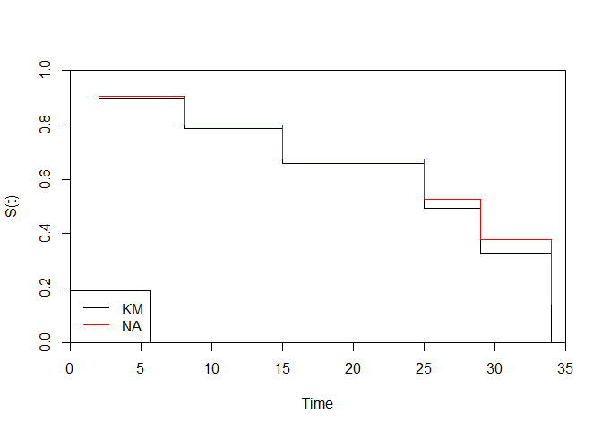
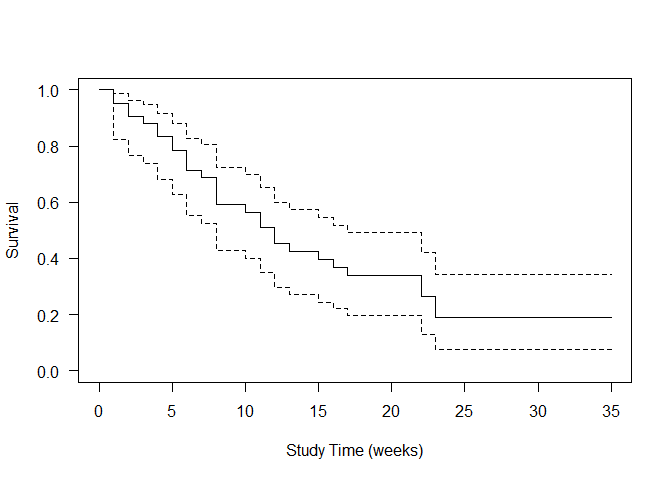
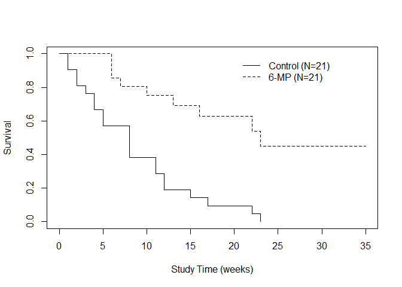
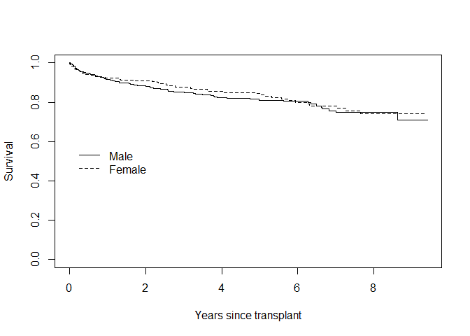

The 6-MP versus placebo clinical trial in acute leukemia (Gehan EA1,
Freireich EJ.)
================
Clinical Trials. 2011 Jun;8(3):288-97. doi: 10.1177/1740774511407358.

## BACKGROUND:

This article gives the status of clinical cancer research in the
1950’s-1960’s and tells the story of the development and conduct of the
6-mercaptopurine (6-MP) versus placebo clinical trial in acute leukemia
through the initiation, design, conduct and analysis stages, with
emphasis on the ethical aspects of randomizing patients to 6-MP or
placebo when in remission.

## PURPOSE:

The specific objective was to compare the lengths of remission for
patients receiving 6-MP or placebo after achieving complete or partial
remission from steroid treatment.

## METHODS:

A randomized, double-blind, placebo controlled sequential study was
conducted in which patients were paired by remission status at each of
the eleven institutions participating in the study, and randomized to
6-MP or placebo within each pair of patients. A preference for 6-MP or
placebo was recorded depending on which patient in the pair had the
longer remission. The preferences were plotted according to a restricted
sequential procedure devised by Peter Armitage and, depending on which
boundary of the design was crossed, a statistically significant
difference could be declared favoring 6-MP, placebo or no preference.

## CONCLUSIONS:

The trial established the efficacy of 6-MP for maintaining longer
remissions in acute leukemia and led to the concept of ‘adjuvant
chemotherapy’, namely that patients with minimal disease have a
substantially better response to chemotherapy than patients with
advanced disease, a concept that has been followed in many other forms
of cancer. Statistically, the fact that many patients were still in
remission when the study was stopped (i.e. the length of remission data
for these patients was ‘right censored’) led to the development of a
generalized Wilcoxon test and was an important influence on Cox’s
development of the proportional hazards model. The trial had an
innovative design in the early 1960’s and has been an important
influence on subsequent clinical research in cancer and statistical
research in survival analysis.

``` r
library(survival)
library(KMsurv) # it needs to be installed
```

    ## Warning: il pacchetto 'KMsurv' è stato creato con R versione 4.3.0

``` r
###########################
#Class example
###########################

#Load data
X=c(2,5,8,12,15,21,25,29,30,34)
delta=c(1,0,1,0,1,0,1,1,0,1) # 1: osservato, 0: censurato
cbind(X,delta)
```

    ##        X delta
    ##  [1,]  2     1
    ##  [2,]  5     0
    ##  [3,]  8     1
    ##  [4,] 12     0
    ##  [5,] 15     1
    ##  [6,] 21     0
    ##  [7,] 25     1
    ##  [8,] 29     1
    ##  [9,] 30     0
    ## [10,] 34     1

``` r
#KM Estimate 
help(Surv)
```

    ## avvio in corso del server httpd per la guida ... fatto

``` r
Surv(X,delta) #curva di sopravvivenza
```

    ##  [1]  2   5+  8  12+ 15  21+ 25  29  30+ 34

``` r
help(survfit) #stima KM curva di sopravvivenza, stima di una distrib marginale non condizionata a nessuna covariata
est1=survfit(Surv(X,delta)~1)

summ_est1=summary(est1)
summ_est1
```

    ## Call: survfit(formula = Surv(X, delta) ~ 1)
    ## 
    ##  time n.risk n.event survival std.err lower 95% CI upper 95% CI
    ##     2     10       1    0.900  0.0949        0.732        1.000
    ##     8      8       1    0.787  0.1340        0.564        1.000
    ##    15      6       1    0.656  0.1638        0.402        1.000
    ##    25      4       1    0.492  0.1878        0.233        1.000
    ##    29      3       1    0.328  0.1834        0.110        0.981
    ##    34      1       1    0.000     NaN           NA           NA

``` r
# Chiedere di interpretare i ci, come sono stati calcolati?
# ultimo s.e. e' zero per definizione se corrisponde a tempo osservato

S_KM=summ_est1$surv 
S_KM #valore della funzione di sopravvivenza
```

    ## [1] 0.9000000 0.7875000 0.6562500 0.4921875 0.3281250 0.0000000

``` r
#Nelson Aalen Estimate
D_j=summ_est1$n.event
Y_j=summ_est1$n.risk
t_j=summ_est1$time

S_NA=rep(NA,length(t_j))
for(i in 1:length(t_j))
{
  S_NA[i]=exp(-sum((D_j/Y_j)[t_j<=t_j[i]])) #operatire logico per i vari istanti temporali
}
cbind(t_j,S_KM,S_NA)
```

    ##      t_j      S_KM      S_NA
    ## [1,]   2 0.9000000 0.9048374
    ## [2,]   8 0.7875000 0.7985162
    ## [3,]  15 0.6562500 0.6759294
    ## [4,]  25 0.4921875 0.5264143
    ## [5,]  29 0.3281250 0.3771924
    ## [6,]  34 0.0000000 0.1387613

``` r
#Plot KM and NA estimators
plot(t_j,S_KM,type="s",xlab="Time",ylab="S(t)",xlim=c(0,max(t_j)+1),ylim=c(0,1),xaxs="i",yaxs="i")
lines(t_j,S_NA,type="s",col="red")
legend("bottomleft",legend=c("KM","NA"),col=c("black","red"),lty=c(1,1))
```

<!-- -->

``` r
#Get restricted mean and median survival
print(est1,print.rmean=TRUE,rmean=20)
```

    ## Call: survfit(formula = Surv(X, delta) ~ 1)
    ## 
    ##       n events rmean* se(rmean) median 0.95LCL 0.95UCL
    ## [1,] 10      6   16.2      1.99     25      15      NA
    ##     * restricted mean with upper limit =  20

``` r
print(est1,print.rmean=TRUE)
```

    ## Call: survfit(formula = Surv(X, delta) ~ 1)
    ## 
    ##       n events rmean* se(rmean) median 0.95LCL 0.95UCL
    ## [1,] 10      6   23.1      3.78     25      15      NA
    ##     * restricted mean with upper limit =  34

``` r
help("print.survfit")
summ_est1
```

    ## Call: survfit(formula = Surv(X, delta) ~ 1)
    ## 
    ##  time n.risk n.event survival std.err lower 95% CI upper 95% CI
    ##     2     10       1    0.900  0.0949        0.732        1.000
    ##     8      8       1    0.787  0.1340        0.564        1.000
    ##    15      6       1    0.656  0.1638        0.402        1.000
    ##    25      4       1    0.492  0.1878        0.233        1.000
    ##    29      3       1    0.328  0.1834        0.110        0.981
    ##    34      1       1    0.000     NaN           NA           NA

``` r
##########################################################################################
#####
#####   Read in 6-MP data
#####
setwd("G:\\Il mio Drive\\TRIENNALE\\Biostatistica\\BioStats\\Data")

# 6-MP leukemia trial
# Time origin: Entry into the study (clinical trial)
# Event of interest: Cancer relapse
# Covariate of interest: Treatment with 6-MP
# all control patients did relapse
##
sixmp <- read.table( "sixmp.txt" )
sixmp[1:5,]
```

    ##   pairid tpbo t6mp irelapse
    ## 1      1    1   10        1
    ## 2      2   22    7        1
    ## 3      3    3   32        0
    ## 4      4   12   23        1
    ## 5      5    8   22        1

``` r
## tpbo: time-to-event placebo group
## t6mp: time-to-event 6mp group

#####
#####   Transform data to long format
#####
sixmpLong <- cbind(rep(sixmp$pairid,2), c(sixmp$tpbo,sixmp$t6mp), 
                     rep(0:1, each=21), c(rep(1,21), sixmp$irelapse ) )
sixmpLong <- as.data.frame( sixmpLong )
names(sixmpLong) <- c( "pairid", "time", "sixmp", "irelapse") 
sixmpLong[ c(1:5,22:26), ]
```

    ##    pairid time sixmp irelapse
    ## 1       1    1     0        1
    ## 2       2   22     0        1
    ## 3       3    3     0        1
    ## 4       4   12     0        1
    ## 5       5    8     0        1
    ## 22      1   10     1        1
    ## 23      2    7     1        1
    ## 24      3   32     1        0
    ## 25      4   23     1        1
    ## 26      5   22     1        1

``` r
##
#####   KM estimates
##

aaa = survfit( Surv( time, irelapse ) ~ 1, data=sixmpLong, conf.type="log-log" )
plot(aaa, lty=1, xlab="Study Time (weeks)", ylab="Survival",las=1 ) #las helps to set y-axes scale
```

<!-- -->

``` r
plot( survfit(Surv(time, irelapse )~ sixmp, data=sixmpLong ),
      lty=1:2, xlab="Study Time (weeks)", ylab="Survival" )
#ottengo quindi 1 curva per i trattati e 1 per i non trattati
legend( 20, 1, lty=1:2, legend=c("Control (N=21)", "6-MP (N=21)"), bty="n" )
```

<!-- -->

``` r
###########################################################################################################

##  Source some usefull functions
source("G:\\Il mio Drive\\TRIENNALE\\Biostatistica\\BioStats\\Functions.R")

##  Read in K & M kidney transplant data - introdotto nella prima lezione (Lezione1.pdf)
kidney <- read.csv( "kidneytransplant.csv", header=TRUE )
dim(kidney)
```

    ## [1] 863   6

``` r
head(kidney)
```

    ##   ptid obstime death gender race age
    ## 1    1       1     0      1    1  46
    ## 2    2       5     0      1    1  51
    ## 3    3       7     1      1    1  55
    ## 4    4       9     0      1    1  57
    ## 5    5      13     0      1    1  45
    ## 6    6      13     0      1    1  43

``` r
##  Recode gender and race to something meaningful
table(kidney$gender)
```

    ## 
    ##   1   2 
    ## 524 339

``` r
kidney$female <- kidney$gender - 1
table(kidney$race)
```

    ## 
    ##   1   2 
    ## 712 151

``` r
kidney$black <- kidney$race - 1
head(kidney)
```

    ##   ptid obstime death gender race age female black
    ## 1    1       1     0      1    1  46      0     0
    ## 2    2       5     0      1    1  51      0     0
    ## 3    3       7     1      1    1  55      0     0
    ## 4    4       9     0      1    1  57      0     0
    ## 5    5      13     0      1    1  45      0     0
    ## 6    6      13     0      1    1  43      0     0

``` r
require("survival")
## Compute overall KM estimate
kmEst.all <- survfit( Surv(obstime, death) ~ 1, data=kidney) 
kmEst.all
```

    ## Call: survfit(formula = Surv(obstime, death) ~ 1, data = kidney)
    ## 
    ##        n events median 0.95LCL 0.95UCL
    ## [1,] 863    140     NA      NA      NA

``` r
summary( kmEst.all )
```

    ## Call: survfit(formula = Surv(obstime, death) ~ 1, data = kidney)
    ## 
    ##  time n.risk n.event survival std.err lower 95% CI upper 95% CI
    ##     2    861       1    0.999 0.00116        0.997        1.000
    ##     3    860       1    0.998 0.00164        0.994        1.000
    ##     7    857       2    0.995 0.00232        0.991        1.000
    ##    10    853       2    0.993 0.00284        0.987        0.999
    ##    17    848       1    0.992 0.00307        0.986        0.998
    ##    21    844       1    0.991 0.00328        0.984        0.997
    ##    26    843       2    0.988 0.00367        0.981        0.996
    ##    28    840       1    0.987 0.00385        0.980        0.995
    ##    37    836       1    0.986 0.00402        0.978        0.994
    ##    40    835       1    0.985 0.00419        0.977        0.993
    ##    43    834       2    0.982 0.00450        0.974        0.991
    ##    44    829       1    0.981 0.00465        0.972        0.990
    ##    45    828       1    0.980 0.00479        0.971        0.989
    ##    50    826       1    0.979 0.00493        0.969        0.989
    ##    52    821       1    0.978 0.00507        0.968        0.988
    ##    56    820       1    0.976 0.00520        0.966        0.987
    ##    57    819       2    0.974 0.00545        0.963        0.985
    ##    59    817       1    0.973 0.00557        0.962        0.984
    ##    62    816       2    0.971 0.00581        0.959        0.982
    ##    68    810       2    0.968 0.00604        0.956        0.980
    ##    69    808       1    0.967 0.00615        0.955        0.979
    ##    78    807       1    0.966 0.00626        0.954        0.978
    ##    79    806       1    0.965 0.00636        0.952        0.977
    ##    88    798       1    0.963 0.00647        0.951        0.976
    ##    91    797       1    0.962 0.00657        0.949        0.975
    ##    97    793       1    0.961 0.00667        0.948        0.974
    ##    98    792       2    0.958 0.00687        0.945        0.972
    ##   104    790       1    0.957 0.00697        0.944        0.971
    ##   106    786       2    0.955 0.00716        0.941        0.969
    ##   119    773       1    0.954 0.00726        0.939        0.968
    ##   121    771       1    0.952 0.00736        0.938        0.967
    ##   135    767       1    0.951 0.00745        0.937        0.966
    ##   143    764       1    0.950 0.00754        0.935        0.965
    ##   150    762       1    0.949 0.00764        0.934        0.964
    ##   154    758       1    0.947 0.00773        0.932        0.963
    ##   158    757       1    0.946 0.00782        0.931        0.962
    ##   162    756       1    0.945 0.00791        0.929        0.960
    ##   190    746       1    0.944 0.00800        0.928        0.959
    ##   206    739       1    0.942 0.00809        0.927        0.958
    ##   209    738       1    0.941 0.00818        0.925        0.957
    ##   228    732       1    0.940 0.00827        0.924        0.956
    ##   229    731       1    0.938 0.00835        0.922        0.955
    ##   242    724       1    0.937 0.00844        0.921        0.954
    ##   248    720       1    0.936 0.00853        0.919        0.953
    ##   249    719       1    0.935 0.00862        0.918        0.952
    ##   252    715       1    0.933 0.00870        0.916        0.950
    ##   273    701       1    0.932 0.00879        0.915        0.949
    ##   291    694       1    0.931 0.00888        0.913        0.948
    ##   297    693       1    0.929 0.00897        0.912        0.947
    ##   311    690       2    0.927 0.00914        0.909        0.945
    ##   334    681       1    0.925 0.00923        0.907        0.943
    ##   340    678       1    0.924 0.00932        0.906        0.942
    ##   344    673       1    0.922 0.00941        0.904        0.941
    ##   346    672       1    0.921 0.00949        0.903        0.940
    ##   354    669       1    0.920 0.00958        0.901        0.939
    ##   366    667       1    0.918 0.00966        0.900        0.937
    ##   391    659       1    0.917 0.00975        0.898        0.936
    ##   402    655       1    0.916 0.00983        0.896        0.935
    ##   421    649       1    0.914 0.00992        0.895        0.934
    ##   439    643       1    0.913 0.01000        0.893        0.933
    ##   450    637       1    0.911 0.01009        0.892        0.931
    ##   470    633       1    0.910 0.01017        0.890        0.930
    ##   478    632       1    0.908 0.01026        0.888        0.929
    ##   481    630       1    0.907 0.01034        0.887        0.927
    ##   490    627       1    0.905 0.01043        0.885        0.926
    ##   495    624       1    0.904 0.01051        0.884        0.925
    ##   570    609       1    0.903 0.01060        0.882        0.924
    ##   583    604       1    0.901 0.01069        0.880        0.922
    ##   614    599       1    0.900 0.01077        0.879        0.921
    ##   615    598       1    0.898 0.01086        0.877        0.920
    ##   621    597       1    0.897 0.01095        0.875        0.918
    ##   652    589       1    0.895 0.01103        0.874        0.917
    ##   697    570       1    0.893 0.01112        0.872        0.916
    ##   730    564       1    0.892 0.01122        0.870        0.914
    ##   773    550       1    0.890 0.01131        0.868        0.913
    ##   776    549       1    0.889 0.01141        0.867        0.911
    ##   790    544       1    0.887 0.01150        0.865        0.910
    ##   793    543       1    0.885 0.01160        0.863        0.908
    ##   806    542       1    0.884 0.01169        0.861        0.907
    ##   840    539       1    0.882 0.01178        0.859        0.905
    ##   852    538       1    0.880 0.01188        0.857        0.904
    ##   864    535       1    0.879 0.01197        0.856        0.903
    ##   875    530       1    0.877 0.01206        0.854        0.901
    ##   929    513       1    0.875 0.01216        0.852        0.900
    ##   939    510       1    0.874 0.01225        0.850        0.898
    ##   943    509       1    0.872 0.01235        0.848        0.897
    ##   945    508       2    0.869 0.01254        0.844        0.893
    ##   946    506       1    0.867 0.01263        0.842        0.892
    ##  1001    494       1    0.865 0.01272        0.841        0.890
    ##  1013    491       1    0.863 0.01282        0.839        0.889
    ##  1016    490       1    0.862 0.01291        0.837        0.887
    ##  1105    479       1    0.860 0.01301        0.835        0.886
    ##  1164    457       1    0.858 0.01312        0.833        0.884
    ##  1186    454       1    0.856 0.01322        0.830        0.882
    ##  1191    453       1    0.854 0.01333        0.828        0.881
    ##  1196    452       1    0.852 0.01343        0.826        0.879
    ##  1210    447       1    0.850 0.01354        0.824        0.877
    ##  1275    430       1    0.848 0.01365        0.822        0.876
    ##  1326    415       1    0.846 0.01377        0.820        0.874
    ##  1331    414       1    0.844 0.01389        0.817        0.872
    ##  1357    410       1    0.842 0.01401        0.815        0.870
    ##  1384    402       1    0.840 0.01413        0.813        0.868
    ##  1388    400       1    0.838 0.01425        0.811        0.866
    ##  1418    398       1    0.836 0.01437        0.808        0.865
    ##  1473    383       1    0.834 0.01449        0.806        0.863
    ##  1509    377       1    0.832 0.01462        0.803        0.861
    ##  1734    329       1    0.829 0.01479        0.800        0.858
    ##  1777    313       1    0.826 0.01498        0.797        0.856
    ##  1820    295       1    0.824 0.01519        0.794        0.854
    ##  1835    294       1    0.821 0.01540        0.791        0.851
    ##  1877    289       1    0.818 0.01560        0.788        0.849
    ##  1940    280       1    0.815 0.01582        0.785        0.847
    ##  2034    254       1    0.812 0.01608        0.781        0.844
    ##  2056    242       1    0.808 0.01636        0.777        0.841
    ##  2108    227       1    0.805 0.01667        0.773        0.838
    ##  2171    221       1    0.801 0.01699        0.769        0.835
    ##  2276    200       1    0.797 0.01737        0.764        0.832
    ##  2291    199       1    0.793 0.01774        0.759        0.829
    ##  2301    196       1    0.789 0.01810        0.754        0.825
    ##  2313    194       1    0.785 0.01846        0.750        0.822
    ##  2369    183       1    0.781 0.01885        0.745        0.819
    ##  2414    176       1    0.776 0.01926        0.740        0.815
    ##  2421    174       1    0.772 0.01966        0.734        0.811
    ##  2489    156       1    0.767 0.02014        0.728        0.807
    ##  2557    146       1    0.762 0.02068        0.722        0.803
    ##  2567    145       1    0.756 0.02119        0.716        0.799
    ##  2650    131       1    0.751 0.02180        0.709        0.795
    ##  2795     97       1    0.743 0.02291        0.699        0.789
    ##  3146     39       1    0.724 0.02919        0.669        0.783

``` r
## Compute and plot KM estimate for each gender
kmEst.gender <- survfit( Surv(obstime, death) ~ female, data=kidney )
#pdf( "/Volumes/work/Teaching/Stat255/Spring2011/Lectures/lecture2/graphs/kidney_km.pdf", width=8, height=6)
plot( kmEst.gender, xscale=365.25, mark.time=F, lty=1:2, ylab="Survival", xlab="Years since transplant"  )
legend( 1, .6, lty=1:2, legend=c("Male", "Female"), bty="n" )
```

<!-- -->

``` r
#dev.off()

##  Estimated survival probabilities at 6mos, 1yr, and 2yrs
## Questa funzione fa parte del file "Funzioni.R
#####   pKM() : Function to pull estimated survival probabilities
#####           at specified times for a fitted KM estimate"
pKM(kmEst.gender, q=c(.5,1,2), xscale=365.25 )
```

    ## $`female=0`
    ##   time    km.est     lower     upper
    ## 1  0.5 0.9467434 0.9273872 0.9665036
    ## 2  1.0 0.9162635 0.8919893 0.9411982
    ## 3  2.0 0.8799810 0.8507622 0.9102033
    ## 
    ## $`female=1`
    ##   time    km.est     lower     upper
    ## 1  0.5 0.9419531 0.9169427 0.9676457
    ## 2  1.0 0.9250765 0.8966287 0.9544268
    ## 3  2.0 0.9103050 0.8789995 0.9427255

``` r
#pKM=probabilita di sopravvivere piu di un certo istante temporale
# NOTE this function devides the observed times by "xscale"

    
##  Estimated 75th percentile of the survival distribution by gender
# Data ordered by strata (male first)
kmEst.gender
```

    ## Call: survfit(formula = Surv(obstime, death) ~ female, data = kidney)
    ## 
    ##            n events median 0.95LCL 0.95UCL
    ## female=0 524     87     NA      NA      NA
    ## female=1 339     53     NA      NA      NA

``` r
kmEst.gender$strata
```

    ## female=0 female=1 
    ##      417      298

``` r
kmEst.gender$strata[1]
```

    ## female=0 
    ##      417

``` r
male.est <- as.data.frame(cbind(kmEst.gender$time, kmEst.gender$surv)[1:kmEst.gender$strata[1], ])
head(male.est)
```

    ##   V1        V2
    ## 1  1 1.0000000
    ## 2  5 1.0000000
    ## 3  7 0.9980843
    ## 4  9 0.9980843
    ## 5 13 0.9980843
    ## 6 17 0.9961575

``` r
female.est <- as.data.frame(cbind(kmEst.gender$time, kmEst.gender$surv)[(kmEst.gender$strata[1]+1):sum(kmEst.gender$strata), ] )
names( male.est ) <- names(female.est) <- c("time", "surv" )

male.est[ min( which(male.est$surv <=.75 ) ), ]
```

    ##     time      surv
    ## 347 2557 0.7479833

``` r
female.est[ min( which(female.est$surv <=.75 ) ), ]
```

    ##     time      surv
    ## 256 2795 0.7402676

``` r
##  An easier way!      
#####   qKM() : Function to estimate quantiles of the survival distribution
#####         using a fitted KM estimate
qKM(kmEst.gender, p=c(.85,.75), xscale=365.25 )
```

    ## $`female=0`
    ##   perc.surv   km.est    lower    upper
    ## 1      0.85 3.025325 2.116359 5.629021
    ## 2      0.75 7.000684 6.332649      Inf
    ## 
    ## $`female=1`
    ##   perc.surv   km.est    lower    upper
    ## 1      0.85 4.865161 2.581793 6.231348
    ## 2      0.75 7.652293 5.943874      Inf

``` r
# check (differences in time scale)
2557/365.25
```

    ## [1] 7.000684

``` r
2795/365.25
```

    ## [1] 7.652293
