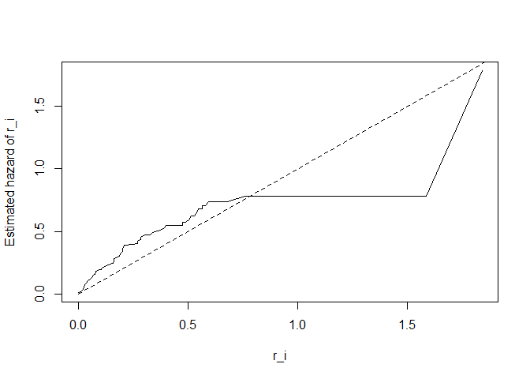

Weibull, Nelson-Aalen estimator, Cox-Snell, and more
================
David Alexander Moe

``` r
library(survival)

#####################################################
# Illustrating the AFT model for a binary covariate
#####################################################


phi=0.5
lambda=1/4
time=seq(from=0,to=20,by=0.1)
S_0=exp(-lambda*time)
S_1=exp(-lambda*time*phi)

plot(time,S_0,type="l",col="black",lwd=2,xlab="Time",ylab="Survival",xaxs="i",yaxs="i")
lines(time,S_1,col="red",lwd=2)
```

<!-- -->

``` r
phi=1.5
lambda=1/4
time=seq(from=0,to=20,by=0.1)
S_0=exp(-lambda*time)
S_1=exp(-lambda*time*phi)

plot(time,S_0,type="l",col="black",lwd=2,xlab="Time",ylab="Survival",xaxs="i",yaxs="i")
lines(time,S_1,col="red",lwd=2)
```

<!-- -->

``` r
#####################################################################
#library(survival)
library(KMsurv)
```

    ## Warning: il pacchetto 'KMsurv' è stato creato con R versione 4.3.0

``` r
###################################
#Weibull Regression - simulated data
###################################

n=200
# Genero due covariate:
Z_1=runif(n)
Z_2=rbinom(n,size=1,prob=0.4)

temp=runif(n)
# Generate errors from a an extreme value distribution
# The Weibull distribution can also be characterized in terms of a uniform distribution: 
# if U is uniformly distributed  on (0,1), then the random variable 
# W=\lambda (-\ln(U))^{1/k} is Weibull distributed with parameter k and \lambda. 
# IF W is Weibull, then ln(W) is extreme value, see also help(survreg.distributions)
W=log(-log(temp))

mu=1
gamma_1=0.2
gamma_2=0.5
sigma=0.5
# Generate times from an AFT:
T=exp(mu+gamma_1*Z_1+gamma_2*Z_2+sigma*W)
help(survreg)
```

    ## avvio in corso del server httpd per la guida ... fatto

``` r
sim_model=survreg(Surv(T,rep(1,n))~Z_1+Z_2,dist="weibull")
summary(sim_model)
```

    ## 
    ## Call:
    ## survreg(formula = Surv(T, rep(1, n)) ~ Z_1 + Z_2, dist = "weibull")
    ##               Value Std. Error      z       p
    ## (Intercept)  0.8854     0.0855  10.36 < 2e-16
    ## Z_1          0.2770     0.1324   2.09   0.037
    ## Z_2          0.4648     0.0805   5.78 7.6e-09
    ## Log(scale)  -0.5921     0.0550 -10.76 < 2e-16
    ## 
    ## Scale= 0.553 
    ## 
    ## Weibull distribution
    ## Loglik(model)= -374.2   Loglik(intercept only)= -392.2
    ##  Chisq= 35.99 on 2 degrees of freedom, p= 1.5e-08 
    ## Number of Newton-Raphson Iterations: 6 
    ## n= 200

``` r
# Note log(0.5) = -0.6931


###############################
#Weibull Regression
###############################
data(alloauto)
help(alloauto)

alloauto$auto=as.numeric(alloauto$type==2)
allo_data=subset(alloauto,alloauto$type==1)
auto_data=subset(alloauto,alloauto$type==2)
head(allo_data)
```

    ##    time type delta auto
    ## 1 0.030    1     1    0
    ## 2 0.493    1     1    0
    ## 3 0.855    1     1    0
    ## 4 1.184    1     1    0
    ## 5 1.283    1     1    0
    ## 6 1.480    1     1    0

``` r
weibull_model_allo=survreg(Surv(time,delta)~1,dist="weibull",data=allo_data)
summary(weibull_model_allo)
```

    ## 
    ## Call:
    ## survreg(formula = Surv(time, delta) ~ 1, data = allo_data, dist = "weibull")
    ##             Value Std. Error    z       p
    ## (Intercept) 4.254      0.478 8.90 < 2e-16
    ## Log(scale)  0.665      0.189 3.51 0.00044
    ## 
    ## Scale= 1.94 
    ## 
    ## Weibull distribution
    ## Loglik(model)= -96   Loglik(intercept only)= -96
    ## Number of Newton-Raphson Iterations: 5 
    ## n= 50

``` r
exp_model_allo=survreg(Surv(time,delta)~1,dist="exponential",data=allo_data)
summary(exp_model_allo)
```

    ## 
    ## Call:
    ## survreg(formula = Surv(time, delta) ~ 1, data = allo_data, dist = "exponential")
    ##             Value Std. Error    z      p
    ## (Intercept) 3.742      0.213 17.6 <2e-16
    ## 
    ## Scale fixed at 1 
    ## 
    ## Exponential distribution
    ## Loglik(model)= -104.3   Loglik(intercept only)= -104.3
    ## Number of Newton-Raphson Iterations: 5 
    ## n= 50

``` r
# LRT of two nested models (Wibull is a generalization of the exponential distribution with one more parameter => 1 degree of freedom)
2*(1-pchisq(2*(weibull_model_allo$loglik[1]-exp_model_allo$loglik[1]),1))
```

    ## [1] 8.987641e-05

``` r
weibull_model_auto=survreg(Surv(time,delta)~1,dist="weibull",data=auto_data)
summary(weibull_model_auto)
```

    ## 
    ## Call:
    ## survreg(formula = Surv(time, delta) ~ 1, data = auto_data, dist = "weibull")
    ##             Value Std. Error     z      p
    ## (Intercept) 3.452      0.218 15.82 <2e-16
    ## Log(scale)  0.105      0.158  0.67   0.51
    ## 
    ## Scale= 1.11 
    ## 
    ## Weibull distribution
    ## Loglik(model)= -123.4   Loglik(intercept only)= -123.4
    ## Number of Newton-Raphson Iterations: 5 
    ## n= 51

``` r
exp_model_auto=survreg(Surv(time,delta)~1,dist="exponential",data=auto_data)
summary(exp_model_auto)
```

    ## 
    ## Call:
    ## survreg(formula = Surv(time, delta) ~ 1, data = auto_data, dist = "exponential")
    ##             Value Std. Error    z      p
    ## (Intercept) 3.417      0.189 18.1 <2e-16
    ## 
    ## Scale fixed at 1 
    ## 
    ## Exponential distribution
    ## Loglik(model)= -123.7   Loglik(intercept only)= -123.7
    ## Number of Newton-Raphson Iterations: 4 
    ## n= 51

``` r
2*(1-pchisq(2*(weibull_model_auto$loglik[1]-exp_model_auto$loglik[1]),1))
```

    ## [1] 0.9885844

``` r
weibull_model=survreg(Surv(time,delta)~auto,dist="weibull",data=alloauto)
summary(weibull_model)
```

    ## 
    ## Call:
    ## survreg(formula = Surv(time, delta) ~ auto, data = alloauto, 
    ##     dist = "weibull")
    ##              Value Std. Error     z      p
    ## (Intercept)  3.968      0.330 12.02 <2e-16
    ## auto        -0.374      0.420 -0.89 0.3742
    ## Log(scale)   0.388      0.123  3.15 0.0016
    ## 
    ## Scale= 1.47 
    ## 
    ## Weibull distribution
    ## Loglik(model)= -222   Loglik(intercept only)= -222.4
    ##  Chisq= 0.8 on 1 degrees of freedom, p= 0.37 
    ## Number of Newton-Raphson Iterations: 5 
    ## n= 101

``` r
###############################
#Q-Q plot
###############################
km_est_allo=survfit(Surv(time,delta)~1,data=allo_data)
km_est_auto=survfit(Surv(time,delta)~1,data=auto_data)

#quick visual check
plot(km_est_allo)
```

<!-- -->

``` r
#Note that the surv function for the allo group cannot be estimated for values of t>20 (correspond to 40 percentile)
plot(km_est_auto)
```

<!-- -->

``` r
q=seq(from=0,to=0.4,by=0.1)
t_allo=rep(NA,length(q))
t_auto=rep(NA,length(q))
for(i in 1:length(q))
{
  t_allo[i]=surv_quantile=min(km_est_allo$time[km_est_allo$surv<=(1-q[i])])
  t_auto[i]=surv_quantile=min(km_est_auto$time[km_est_auto$surv<=(1-q[i])])
}
plot(t_auto,t_allo,type="l",xlab="Estimated percentile for auto group",ylab="Estimated percentile for allo group",xlim=c(0,13),ylim=c(0,13))
```

<!-- -->

``` r
#Check whether the survival times have the same distribution in the two groups

###############################
#Univariate Models - model fit
###############################

#######Allo group
#NA estimate
km_est_allo=survfit(Surv(time,delta)~1,data=allo_data)

#Nelson Aalen Estimate
D_j=summary(km_est_allo)$n.event
Y_j=summary(km_est_allo)$n.risk
t_j=summary(km_est_allo)$time

NA_est_allo=rep(NA,length(t_j))
for(i in 1:length(t_j))
{
  NA_est_allo[i]=sum((D_j/Y_j)[t_j<=t_j[i]])
}

#Exponential
plot(c(0,t_j),c(0,NA_est_allo),type="p",pch=20,xlab="t",ylab=expression(Lambda(t)))
lines(c(0,t_j[length(t_j)-1]),c(0,NA_est_allo[length(NA_est_allo)-1]),type="l",lty=2)
```

<!-- -->

``` r
#"Lambda(t)")

#Weibull
plot(log(t_j),log(NA_est_allo),type="p",pch=20,xlab="log(t)",ylab=expression(log(Lambda(t))))
lines(c(log(t_j)[1],log(t_j)[length(t_j)]),c(log(NA_est_allo)[1],log(NA_est_allo)[length(NA_est_allo)]),type="l",lty=2)
```

<!-- -->

``` r
# #Log-logistic
plot(log(t_j),log(exp(NA_est_allo)-1),type="p",pch=20,xlab="log(t)",ylab=expression(log(exp(Lambda(t))-1)))
lines(c(log(t_j)[1],log(t_j)[length(t_j)]),c(log(exp(NA_est_allo)-1)[1],log(exp(NA_est_allo)-1)[length(NA_est_allo)]),type="l",lty=2)
```

<!-- -->

``` r
# #Log-Normal
#plot(log(t_j),qnorm(1-exp(-NA_est_allo)),type="p",pch=20,xlab="t",ylab="Phi^(-1)[1-exp{-Lambda(t)}]")
#lines(c(log(t_j)[1],log(t_j)[length(t_j)]),c(qnorm(1-exp(-NA_est_allo))[1],qnorm(1-exp(-NA_est_allo))[length(NA_est_allo)]),type="l",lty=2)

#######Auto group
#NA estimate
km_est_auto=survfit(Surv(time,delta)~1,data=auto_data)

#Nelson Aalen Estimate
D_j=summary(km_est_auto)$n.event
Y_j=summary(km_est_auto)$n.risk
t_j=summary(km_est_auto)$time

NA_est_auto=rep(NA,length(t_j))
for(i in 1:length(t_j))
{
  NA_est_auto[i]=sum((D_j/Y_j)[t_j<=t_j[i]])
}

#Exponential
plot(c(0,t_j),c(0,NA_est_auto),type="p",pch=20,xlab="t",ylab=expression(Lambda(t)))
lines(c(0,t_j[length(t_j)]),c(0,NA_est_auto[length(NA_est_auto)]),type="l",lty=2)
```

<!-- -->

``` r
#Weibull
plot(log(t_j),log(NA_est_auto),type="p",pch=20,xlab="log(t)",ylab=expression(log(Lambda(t))))
lines(c(log(t_j)[1],log(t_j)[length(t_j)]),c(log(NA_est_auto)[1],log(NA_est_auto)[length(NA_est_auto)]),type="l",lty=2)
```

<!-- -->

``` r
# #Log-logistic
plot(log(t_j),log(exp(NA_est_auto)-1),type="p",pch=20,xlab="t",ylab=expression(log(exp(Lambda(t))-1)))
lines(c(log(t_j)[1],log(t_j)[length(t_j)]),c(log(exp(NA_est_auto)-1)[1],log(exp(NA_est_auto)-1)[length(NA_est_auto)]),type="l",lty=2)
```

<!-- -->

``` r
###############################
#Cox-Snell residuals
###############################
##############Exponential
exponential_model=survreg(Surv(time,delta)~auto,dist="exponential",data=alloauto)
summary(exponential_model)
```

    ## 
    ## Call:
    ## survreg(formula = Surv(time, delta) ~ auto, data = alloauto, 
    ##     dist = "exponential")
    ##              Value Std. Error     z      p
    ## (Intercept)  3.742      0.213 17.55 <2e-16
    ## auto        -0.325      0.285 -1.14   0.25
    ## 
    ## Scale fixed at 1 
    ## 
    ## Exponential distribution
    ## Loglik(model)= -228   Loglik(intercept only)= -228.6
    ##  Chisq= 1.31 on 1 degrees of freedom, p= 0.25 
    ## Number of Newton-Raphson Iterations: 5 
    ## n= 101

``` r
#Vedi slide 5.40
#Calculate Cox-Snell residuals for exponential AFT - and their KM estimate
#Vedi slide 5.42
r_exp=alloauto$time*exp(-(exponential_model$linear.predictors))
km_est=survfit(Surv(r_exp,alloauto$delta)~1)

#Nelson Aalen Estimate
D_j=km_est$n.event
Y_j=km_est$n.risk
t_j=km_est$time
NA_est_exp=rep(NA,length(D_j))
for(i in 1:length(D_j))
{
  NA_est_exp[i]=sum((D_j/Y_j)[t_j<=t_j[i]])
}
# Note that km_est$time are the residuals for the non-cesored observations
# Note 2: Cox-Snell residuals should follow a unit exponential distribution, or equivalently the 
# plot of their cumulative hazard function Vs the residuals should 
# give a straight line with unit slope   
plot(km_est$time,NA_est_exp,type="l",xlab="r_i",ylab="Estimated hazard of r_i")
lines(c(0,5),c(0,5),lty=2)
```

<!-- -->

``` r
##############Weibull
weibull_model=survreg(Surv(time,delta)~auto,dist="weibull",data=alloauto)
summary(weibull_model)
```

    ## 
    ## Call:
    ## survreg(formula = Surv(time, delta) ~ auto, data = alloauto, 
    ##     dist = "weibull")
    ##              Value Std. Error     z      p
    ## (Intercept)  3.968      0.330 12.02 <2e-16
    ## auto        -0.374      0.420 -0.89 0.3742
    ## Log(scale)   0.388      0.123  3.15 0.0016
    ## 
    ## Scale= 1.47 
    ## 
    ## Weibull distribution
    ## Loglik(model)= -222   Loglik(intercept only)= -222.4
    ##  Chisq= 0.8 on 1 degrees of freedom, p= 0.37 
    ## Number of Newton-Raphson Iterations: 5 
    ## n= 101

``` r
#Vedi slide 5.40
#Calculate Cox-Snell residuals for Weibull AFT - and their KM estimate
r_weibull=(alloauto$time^(1/weibull_model$scale))*exp(-(weibull_model$linear.predictors)/weibull_model$scale)
km_est=survfit(Surv(r_weibull,alloauto$delta)~1)

#Nelson Aalen Estimate
t_j=km_est$time
D_j=km_est$n.event
Y_j=km_est$n.risk
NA_est_weibull=rep(NA,length(D_j))
for(i in 1:length(D_j))
{
  NA_est_weibull[i]=sum((D_j/Y_j)[t_j<=t_j[i]])
}
plot(km_est$time,NA_est_weibull,type="l",xlab="r_i",ylab="Estimated hazard of r_i")
lines(c(0,5),c(0,5),lty=2)
```

<!-- -->

``` r
########Example with multiple covariates
data(bmt)
help(bmt)
head(bmt)
```

    ##   group   t1   t2 d1 d2 d3   ta da  tc dc tp dp z1 z2 z3 z4 z5 z6   z7 z8 z9
    ## 1     1 2081 2081  0  0  0   67  1 121  1 13  1 26 33  1  0  1  1   98  0  1
    ## 2     1 1602 1602  0  0  0 1602  0 139  1 18  1 21 37  1  1  0  0 1720  0  1
    ## 3     1 1496 1496  0  0  0 1496  0 307  1 12  1 26 35  1  1  1  0  127  0  1
    ## 4     1 1462 1462  0  0  0   70  1  95  1 13  1 17 21  0  1  0  0  168  0  1
    ## 5     1 1433 1433  0  0  0 1433  0 236  1 12  1 32 36  1  1  1  1   93  0  1
    ## 6     1 1377 1377  0  0  0 1377  0 123  1 12  1 22 31  1  1  1  1 2187  0  1
    ##   z10
    ## 1   0
    ## 2   0
    ## 3   0
    ## 4   0
    ## 5   0
    ## 6   0

``` r
test=survreg(Surv(t1,d1)~z1+z3+z9,data=bmt,dist="weibull")
summary(test)
```

    ## 
    ## Call:
    ## survreg(formula = Surv(t1, d1) ~ z1 + z3 + z9, data = bmt, dist = "weibull")
    ##               Value Std. Error     z       p
    ## (Intercept)  7.0776     0.6293 11.25 < 2e-16
    ## z1          -0.0328     0.0196 -1.67  0.0951
    ## z3           0.5734     0.3503  1.64  0.1016
    ## z9           0.4895     0.1709  2.86  0.0042
    ## Log(scale)   0.4224     0.0959  4.41 1.1e-05
    ## 
    ## Scale= 1.53 
    ## 
    ## Weibull distribution
    ## Loglik(model)= -650.3   Loglik(intercept only)= -655.9
    ##  Chisq= 11.26 on 3 degrees of freedom, p= 0.01 
    ## Number of Newton-Raphson Iterations: 5 
    ## n= 137

``` r
#################################################
################# COX PH ########################
#################################################

setwd("G:/Il mio Drive/TRIENNALE/Biostatistica/BioStats/Data")
source("G:/Il mio Drive/TRIENNALE/Biostatistica/BioStats/Functions.R")
##  Read in breast cancer data
brca <- read.table("brca.txt", header=TRUE )
head(brca)
```

    ##   time idead ihresp
    ## 1   19     1      1
    ## 2   25     1      1
    ## 3   30     1      1
    ## 4   34     1      1
    ## 5   37     1      1
    ## 6   46     1      1

``` r
##
#####   KM plot estimates of survival
##
#kmPlot(survfit(Surv(time,idead) ~ ihresp, data=brca ), xscale=0.0001, 
#       groupLabels=c("IH Positive", "IH Negative"), ymarOffset=0)
plot(survfit(Surv(time,idead) ~ ihresp, data=brca ))
legend(90, 1, lty=1:2, legend=c("IH Positive", "IH Negative"), bty="n" )
```

<!-- -->

``` r
##
#####   Fit Cox model to obtain HR estimate
##
help(coxph)
fit <- coxph( Surv( time, idead ) ~ ihresp, data=brca )
summary( fit )
```

    ## Call:
    ## coxph(formula = Surv(time, idead) ~ ihresp, data = brca)
    ## 
    ##   n= 45, number of events= 24 
    ## 
    ##          coef exp(coef) se(coef)     z Pr(>|z|)  
    ## ihresp 0.9802    2.6650   0.4349 2.254   0.0242 *
    ## ---
    ## Signif. codes:  0 '***' 0.001 '**' 0.01 '*' 0.05 '.' 0.1 ' ' 1
    ## 
    ##        exp(coef) exp(-coef) lower .95 upper .95
    ## ihresp     2.665     0.3752     1.136      6.25
    ## 
    ## Concordance= 0.583  (se = 0.042 )
    ## Likelihood ratio test= 4.45  on 1 df,   p=0.03
    ## Wald test            = 5.08  on 1 df,   p=0.02
    ## Score (logrank) test = 5.49  on 1 df,   p=0.02

``` r
##
#####
#####   Larynx cancer example from K & M (1.8)
#####
##
larynx <- read.table( "larynx.txt" )
larynx[1:10,]
```

    ##    stage t2death age year death
    ## 1      1     0.6  77   76     1
    ## 2      1     1.3  53   71     1
    ## 3      1     2.4  45   71     1
    ## 4      1     2.5  57   78     0
    ## 5      1     3.2  58   74     1
    ## 6      1     3.2  51   77     0
    ## 7      1     3.3  76   74     1
    ## 8      1     3.3  63   77     0
    ## 9      1     3.5  43   71     1
    ## 10     1     3.5  60   73     1

``` r
##
#####   Fit Cox model
##
fit <- coxph( Surv( t2death, death ) ~ age + factor(stage), data=larynx )
summary( fit )
```

    ## Call:
    ## coxph(formula = Surv(t2death, death) ~ age + factor(stage), data = larynx)
    ## 
    ##   n= 90, number of events= 50 
    ## 
    ##                   coef exp(coef) se(coef)     z Pr(>|z|)    
    ## age            0.01903   1.01921  0.01426 1.335   0.1820    
    ## factor(stage)2 0.14004   1.15032  0.46249 0.303   0.7620    
    ## factor(stage)3 0.64238   1.90100  0.35611 1.804   0.0712 .  
    ## factor(stage)4 1.70598   5.50678  0.42191 4.043 5.27e-05 ***
    ## ---
    ## Signif. codes:  0 '***' 0.001 '**' 0.01 '*' 0.05 '.' 0.1 ' ' 1
    ## 
    ##                exp(coef) exp(-coef) lower .95 upper .95
    ## age                1.019     0.9811    0.9911     1.048
    ## factor(stage)2     1.150     0.8693    0.4647     2.848
    ## factor(stage)3     1.901     0.5260    0.9459     3.820
    ## factor(stage)4     5.507     0.1816    2.4086    12.590
    ## 
    ## Concordance= 0.682  (se = 0.039 )
    ## Likelihood ratio test= 18.31  on 4 df,   p=0.001
    ## Wald test            = 21.15  on 4 df,   p=3e-04
    ## Score (logrank) test = 24.78  on 4 df,   p=6e-05

``` r
##
#####   LR test of stage
##
fit.red <- coxph( Surv( t2death, death ) ~ age, data=larynx )
anova(fit.red, fit)
```

    ## Analysis of Deviance Table
    ##  Cox model: response is  Surv(t2death, death)
    ##  Model 1: ~ age
    ##  Model 2: ~ age + factor(stage)
    ##    loglik  Chisq Df Pr(>|Chi|)   
    ## 1 -195.55                        
    ## 2 -187.71 15.681  3   0.001318 **
    ## ---
    ## Signif. codes:  0 '***' 0.001 '**' 0.01 '*' 0.05 '.' 0.1 ' ' 1

``` r
##
#####   LR test of age by stage interaction
##
fit.int <- coxph( Surv( t2death, death ) ~ age*factor(stage), data=larynx )
summary( fit.int )
```

    ## Call:
    ## coxph(formula = Surv(t2death, death) ~ age * factor(stage), data = larynx)
    ## 
    ##   n= 90, number of events= 50 
    ## 
    ##                          coef  exp(coef)   se(coef)      z Pr(>|z|)  
    ## age                -0.0029316  0.9970726  0.0260842 -0.112   0.9105  
    ## factor(stage)2     -8.0837626  0.0003085  3.6936310 -2.189   0.0286 *
    ## factor(stage)3     -0.1640441  0.8487046  2.4741580 -0.066   0.9471  
    ## factor(stage)4      0.8252625  2.2824798  2.4229272  0.341   0.7334  
    ## age:factor(stage)2  0.1223635  1.1301648  0.0525280  2.329   0.0198 *
    ## age:factor(stage)3  0.0120336  1.0121063  0.0375387  0.321   0.7485  
    ## age:factor(stage)4  0.0142237  1.0143253  0.0359313  0.396   0.6922  
    ## ---
    ## Signif. codes:  0 '***' 0.001 '**' 0.01 '*' 0.05 '.' 0.1 ' ' 1
    ## 
    ##                    exp(coef) exp(-coef) lower .95 upper .95
    ## age                0.9970726     1.0029 9.474e-01    1.0494
    ## factor(stage)2     0.0003085  3241.4063 2.214e-07    0.4298
    ## factor(stage)3     0.8487046     1.1783 6.649e-03  108.3337
    ## factor(stage)4     2.2824798     0.4381 1.977e-02  263.5156
    ## age:factor(stage)2 1.1301648     0.8848 1.020e+00    1.2527
    ## age:factor(stage)3 1.0121063     0.9880 9.403e-01    1.0894
    ## age:factor(stage)4 1.0143253     0.9859 9.453e-01    1.0883
    ## 
    ## Concordance= 0.694  (se = 0.039 )
    ## Likelihood ratio test= 24.66  on 7 df,   p=9e-04
    ## Wald test            = 24.5  on 7 df,   p=9e-04
    ## Score (logrank) test = 29.13  on 7 df,   p=1e-04

``` r
anova(fit, fit.int)
```

    ## Analysis of Deviance Table
    ##  Cox model: response is  Surv(t2death, death)
    ##  Model 1: ~ age + factor(stage)
    ##  Model 2: ~ age * factor(stage)
    ##    loglik  Chisq Df Pr(>|Chi|)  
    ## 1 -187.71                       
    ## 2 -184.53 6.3525  3    0.09567 .
    ## ---
    ## Signif. codes:  0 '***' 0.001 '**' 0.01 '*' 0.05 '.' 0.1 ' ' 1

``` r
# Testing "other" effects (functions from Funzioni.R)
##

##
#####   Estimate 5-year "effect" of age
##
# Suppose we were interested in the 5-year effect of age. then 5 \beta_1 is the 
# log-relative hazard comparing populations that differ in age at diagnosis by five years:
# Could re-fit the model, using I(age/5), or....
linContr.coxph( model=fit, contr.names="age", contr.coef=5 )
```

    ## 
    ## Test of H_0: exp( 5*age ) = 1 :

    ##   exp( Est ) se.est zStat  pVal ci95.lo ci95.hi
    ## 1        1.1  0.071 1.335 0.182   0.956   1.265

``` r
##
#####   Compare stage 3 to stage 2
# Suppose we wished to compare the age-adjusted hazard for stage 3 subjects to that of a stage 2 
# subjects . . .
# Example: compare stage 3 65 year-olds to a stage 2 65-year olds
# (\beta_3-\beta_2) is the log-hazard ratio of stage 3 subjects compared to stage 2 
# subjects who are similar in age
##
linContr.coxph( model=fit, contr.names=c("factor(stage)3", "factor(stage)2"), contr.coef=c(1,-1) )
```

    ## 
    ## Test of H_0: exp( 1*factor(stage)3 + -1*factor(stage)2 ) = 1 :

    ##   exp( Est ) se.est zStat  pVal ci95.lo ci95.hi
    ## 1      1.653  0.452 1.112 0.266   0.682   4.005

``` r
linContr.coxph( model=fit, contr.names=c("factor(stage)4", "factor(stage)3"), contr.coef=c(1,-1) )
```

    ## 
    ## Test of H_0: exp( 1*factor(stage)4 + -1*factor(stage)3 ) = 1 :

    ##   exp( Est ) se.est zStat pVal ci95.lo ci95.hi
    ## 1      2.897  0.411  2.59 0.01   1.295   6.479

``` r
#####   Estimate relative hazard stage3:stage1 for 70 year olds 
# Investigate Effect Modification: 
# Compare stage 3 70 year olds to a stage 1 70 year olds
#(beta_3 + 70 beta_6) is the log-relative hazard comparing these two subpopulations
##
linContr.coxph( model=fit.int, contr.names=c("factor(stage)3", "age:factor(stage)3"), contr.coef=c(1,70) )
```

    ## 
    ## Test of H_0: exp( 1*factor(stage)3 + 70*age:factor(stage)3 ) = 1 :

    ##   exp( Est ) se.est zStat  pVal ci95.lo ci95.hi
    ## 1      1.971  0.398 1.705 0.088   0.904   4.298

``` r
# From the output below, we estimate that the risk of death among 70 year old 
# stage 3 patients is approximately 1.97-times that of 70 year old stage 1 
# patients(95% CI: 0.904, 4.298). This result is not significant based upon a level .05 test.
```
